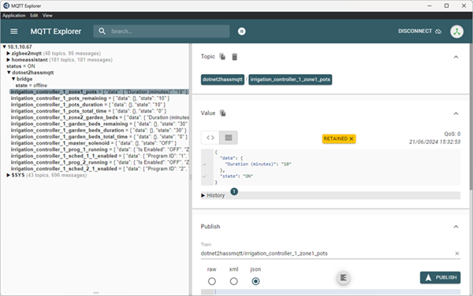
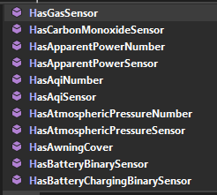
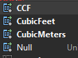


[](https://github.com/NoeticTools/Net2HassMqtt/actions/workflows/dotnet.yml)


# Net2HassMqtt

> [!NOTE]  
> This project is pre-release with much of the code untested.
> Early testing and feedback would be great!

Net2HassMqtt provides [Home Assistant](https://www.home-assistant.io/) (HASS) integration to .NET applications via [MQTT](https://mqtt.org/).
It not a MQTT transport layer. It provides a Home Assistant centric fluent configuration interface to map your application's models to Home Assistant entities.

The devices and entities you configure automatically appear fully configured in Home Assistant ([Home Assistant MQTT Discovery](https://www.home-assistant.io/integrations/mqtt/#mqtt-discovery)).
Configure once, use twice & no YAML! :-)

You do not need to code any MQTT publish calls, value conversions, subscriptions, or connection management. 
It just all happens. Net2HassMqtt layers over [MQTT](https://mqtt.org/) so you do not have to. 
It is designed to let you work with the _"what"_ (Home Assistant) not the _"how"_ (MQTT).

Use by adding NuGet package [NoeticTools.Net2HassMqtt](https://www.nuget.org/packages/NoeticTools.Net2HassMqtt) to your project.

As a quick example, here is a Net2HassMqtt configration code fragment that connects a application's `model` to Home Assistant.

```csharp
    // Create a device to hold the entities
    var device = new DeviceBuilder().WithFriendlyName("Net2HassMqtt Quick Start Device 1")
                                    .WithId("net2hassmqtt_quick_start_device_01");

    // Map model property to an entity
    device.HasBatteryChargingBinarySensor(config => config.OnModel(model)
                                                          .WithStatusProperty(nameof(QuickStartDemoModel.BatteryChaging))
                                                          .WithUnitOfMeasurement(BatteryChargingBinarySensorUoM.None)
                                                          .WithFriendlyName("Battery Charging Status")
                                                          .WithNodeId("battery_1_charging"));

    // Build bridge
    var bridge = new BridgeConfiguration().WithMqttOptions(mqttClientOptions)
                                          .HasDevice(device)
                                          .Build();

    // Run
    await bridge.StartAsync();
```

A device with entity then appears in Home Assistant as shown below:


## Table of Contents

- [Getting Started](#getting-started)
  - [Prerequisites](#prerequisites)
  - [Recommended Tool](#recommended-tool)
  - [Quick Start](#quick-start)
- [Usage](#usage)
  - [Concepts](#concepts)
  - [MQTT broker connection](#mqtt-broker-connection)
  - [Your Application](#your-application)
  - [Devices](#devices)
  - [Entities](#entities)
    - [Naming](#naming)
    - [Entity ID & Node ID](#entity-id-node-id)
    - [Entity Attributes](#entity-attributes)
    - [Command Only Entities](#command-only-entities)
    - [State/Diagnostic/Configuration Categories](#statediagnosticconfiguration-categories)
    - [Entity Icon](#entity-icon)
- [Versioning](#versioning)
- [License](#license)
- [Acknowledgments](#acknowledgments)

## Getting Started

> [!TIP]
> After Net2HassMqtt adds a new device in Home Assistant, the  first time you browse to its Device Info dialog it will probably only show one entity.
> To see all entities it is necessary to refresh the brower's page. This only happens first time viewed after the device is added.

### Prerequisites

To get started you will need an [MQTT Broker](https://en.wikipedia.org/wiki/MQTT#MQTT_broker) and Home Assistant. 
Using MQTT with Home Assistant is common and there are many sites and videos to help with installing both.
Have a look at:

* [Home Assistant - Installation](https://www.home-assistant.io/installation/)
* [Home Assistant - MQTT](https://www.home-assistant.io/integrations/mqtt/)
* [MQTT](https://mqtt.org)

Net2HassMqtt has been tested using the [Home Assistant Mosquitto add-on](https://github.com/home-assistant/addons/blob/master/mosquitto/DOCS.md) connected to a stand-alone [Eclipse Mosquitto broker](https://mosquitto.org/).

### Recommended Tool

[MQTT Explorer](http://mqtt-explorer.com/) is highly recommended.
It is a simple GUI tool that can connect to an MQTT broker and browse what is on the server.
It is great for debugging any MQTT broker connection issues or to confirm last value sent.



### Quick Start

A walkthough creating a simple demonstration console application that creats device and entity in home assistant.
This code can be found at [QuickStartDemoApp Program.cs](/Demos/DemoApp/Program.cs)).

The application requires the NuGet packages:

* NoeticTools.Net2HassMqtt (the sample app in the repository uses project reference instead)
* [CommunityToolkit.Mvvm](https://www.nuget.org/packages/CommunityToolkit.Mvvm)

Then add a class that will be our application's entity model:

```csharp
public class QuickStartDemoModel : ObservableObject
{
    private bool _batteryCharging;

    public bool BatteryCharging
    {
        get => _batteryCharging;
        set
        {
            if (SetProperty(ref _batteryChaging, value))
            {
                Console.WriteLine($" Battery is charging: {BatteryChaging}");
            }
        }
    }
}
```

This code creates a class that supports [property changed notification](https://learn.microsoft.com/en-us/dotnet/api/system.componentmodel.inotifypropertychanged?view=net-8.0). 
Each time `LightSwitch` changes state (different value) a property changed notification is sent.

This version of the code is verbose and is used to make the notifying state property `LightSwitch` visible.

> [!TIP]
> An easier approach of declaring `LightSwitch` property is:
>
> ```csharp
> public partial class MyDemoModel : ObservableObject
> {
>     [ObservableProperty] private bool _lightSwitch;
> }
> ```

The console application's `Program.cs` code looks like this:

```csharp
internal class Program
{
    private static async Task Main(string[] args)
    {
        Console.WriteLine("""
                          Net2HassMqtt Quick Start Demo"

                          Press:
                              'x' to exit
                              '1' to toggle the state property

                          """);

        var appConfig = new ConfigurationBuilder().AddUserSecrets<Program>().Build();

        // Create a sample application model
        var model = new QuickStartDemoModel
        {
            BatteryCharging = true
        };

        // Configure a Home Assistant device
        var device = new DeviceBuilder().WithFriendlyName("Net2HassMqtt Quick Start Device 1")
                                        .WithId("net2hassmqtt_quick_start_device_01");

        // Map model property to a Home Assistant entity
        device.HasBatteryChargingBinarySensor(config => config.OnModel(model)
                                                              .WithStatusProperty(nameof(QuickStartDemoModel.BatteryChaging))
                                                              .WithFriendlyName("Battery Charging Status")
                                                              .WithNodeId("battery_1_charging"));

        // Build the MQTT bridge
        var mqttOptions = HassMqttClientFactory.CreateQuickStartOptions("net2hassmqtt_quick_start", appConfig);
        var bridge = new BridgeConfiguration()
                     .WithMqttOptions(mqttOptions)
                     .HasDevice(device)
                     .Build();

        // Run!
        await bridge.StartAsync();
        await Run(model);
        await bridge.StopAsync();

        Console.WriteLine("Finished");
    }

    private static async Task Run(QuickStartDemoModel model)
    {
        while (true)
        {
            await Task.Delay(100.Milliseconds());
            if (Console.KeyAvailable)
            {
                var key = Console.ReadKey();
                if (key.KeyChar == 'x')
                {
                    break;
                }

                if (key.KeyChar == '1')
                {
                    model.BatteryCharging = !model.BatteryCharging;
                }
            }
        }
    }
}
```

Breaking this down ... 

Firstly a Home Assistant device is configured by the line:

```csharp
    var device = new DeviceBuilder().WithFriendlyName("Net2HassMqtt Quick Start Device 1")
                                    .WithId("net2hassmqtt_quick_start_device_01");
```

This device is given the name `Net2HassMqtt Quick Start Device 1` and device ID `net2hassmqtt_quick_start_device_01`.
The device ID will be used as a prefix to all entity IDs (`object_id`). The device ID must not change.

Then a property on the application's model is mapped to a Home Assistant entity:

```csharp
    device.HasBatteryChargingBinarySensor(config => config.OnModel(model)
                                                            .WithStatusProperty(nameof(QuickStartDemoModel.BatteryChaging))
                                                            .WithFriendlyName("Battery Charging Status")
                                                            .WithNodeId("battery_1_charging"));
```

The entity's node ID must not change. It is used with the device ID to build the entities unique ID. 
This entity's ID will be:

> `binary_sensor.net2hassmqtt_quick_start_device_01_attery_1_charging`.

The Net2HassMqtt bridge built with the lines:

```csharp
    var mqttOptions = HassMqttClientFactory.CreateQuickStartOptions("net2hassmqtt_quick_start", appConfig);
    var bridge = new BridgeConfiguration()
                    .WithMqttOptions(mqttOptions)
                    .HasDevice(device)
                    .Build();
```

> [!IMPORTANT]  
> The quick start MQTT options require the MQTT broker's address, username, and password secrets.
> The code obtains these from a store using the [.NET project secrets in development](https://learn.microsoft.com/en-us/aspnet/core/security/app-secrets?view=aspnetcore-8.0&tabs=windows#use-visual-studio) tool.
>
> To setup these secrets see [Developer Secrets](/Documentation/DeveloperSecrets.md)
> or run the application and read the exception message instructions.

The bridge starts/stops with the lines:

```csharp
    await bridge.StartAsync();
        :
    // your could be run application here
        :
    await bridge.StopAsync();
```

Run the console application and it will connect to the MQTT broker!

> [!TIP]
> If it is unable to connect to the MQTT it will keep retrying every few seconds.
> Use [MQTT Explorer](http://mqtt-explorer.com/) to check the connection detials and if the MQTT broker is running.
> It is must faster doing this in MQTT Explorer's UI.

On connection it sends the new device and entity configuration to the MQTT broker and they will appear automatically in Home Assistant.

> [!TIP]
> If viewing the Home Assistant Device Info dialog first time after the
> device is added to Home Assistant, remember to refresh the browser page.

Try these quick tests:

* Press '1' and you will see the light entity toggle state in Home Assistant.
* Press 'x' or close the console and the entity will immediately become "unavailable" in Home Assistant.
* Restart the application and the entity will immediately return to on-line operation.
* Shutdown the application, then delete the device in Home Assistant (yes really!). Now restart the application and the device reappears in Home Assistant.


## Usage

### Concepts

[Entities](https://www.home-assistant.io/docs/glossary/#entity) are central to Home Assistant they can have a status (value) and or a command action such as turn on or set level.
An entity status can optionally have [attributes](https://www.home-assistant.io/docs/configuration/state_object/#attributes) which are like labelled sub values.
Attributes provide additional information related to the status.

An entity has a [domain](https://www.home-assistant.io/docs/glossary/#domain) and a device class. Each device class has a set of units of measurement.
The are all modelled in Net2HassMqtt's fluid configuration framework.

Supported Home Assistant entity domains are:

* BinarySensor
* Cover _(open/close only, proportional covers not yet supported)_
* Number
* Sensor
* Switch
* Valve _(open/close only, proportional valves not yet supported)_

For each domain there is a set of device classes like `Duration`, `Gas`, or `AtmosphericPressure`. 
Net2HassMqtt uses "entity type" names using the format `<domain_class><domain>` like `GasSensor` or `DurationSensor`.
There are 100+ of these entity types like:

* GasSensor
* CabonMonoxideSensor
* DurationSensor
* GasValve
* WaterValve
* ...

Screenshot showing intellisense selection of these entity types:



Entity type have one or more units of measurement like kg, oz, meters, ft, or hours.

Screenshot showing intellisense selection of Measurement (UoM) when a `SensorGas` entity is being configured:



_For more information see:_

* [Home Assistant Concepts](https://www.home-assistant.io/getting-started/concepts-terminology/)
* [Home Assistant Glossary](https://www.home-assistant.io/docs/glossary/)

### MQTT broker connection

Net2HassMqtt is based on [MQTTnet](https://github.com/dotnet/MQTTnet) which uses a `MqttClientOptionsBuilder` class to configure the connection.
`MqttClientOptionsBuilder` code examples can be founder [here](https://github.com/dotnet/MQTTnet/blob/master/Samples/Client/Client_Connection_Samples.cs).

Net2HassMqtt includes a bundled quick start MQTTnet options that is known to work well on a local [Eclipse Mosquitto broker](https://mosquitto.org/).

Example code using the bundled MQTT options:

```csharp
    var appConfig = new ConfigurationBuilder().AddUserSecrets<Program>().Build();

    var mqttOptions = HassMqttClientFactory.CreateQuickStartOptions("net2hassmqtt_my_app_client", appConfig);
    var bridge = new BridgeConfiguration()
                    .WithMqttOptions(mqttOptions)
                    .HasDevice(device)
                    .Build();
```

> [!IMPORTANT]  
> The quick start MQTT options require the MQTT broker's address, username, and password secrets.
> The code obtains these from a store using the [.NET project secrets in development](https://learn.microsoft.com/en-us/aspnet/core/security/app-secrets?view=aspnetcore-8.0&tabs=windows#use-visual-studio) tool.
>
> To setup these secrets see [Developer Secrets](/Documentation/DeveloperSecrets.md)
> or run the application and read the exception message instructions.


### Your Application

#### Providing entity models

An entity model is an application supplied model that provides at least one of:

* An entity status like on/off or temperature.
* An entity command handler to handle and entity's commands like start/stop or set temperature.

> [!Note]
> For entity status the model provides a property getter. This called a **status property**.
> 
> For entity command handling the model provides a method. This called a **command method**.

Each entity model must implement [`INotifyPropertyChanged`](https://learn.microsoft.com/en-us/dotnet/api/system.componentmodel.inotifypropertychanged?view=net-8.0) (or inherit from [`ObservableObject`](https://learn.microsoft.com/en-us/dotnet/communitytoolkit/mvvm/observableobject)).

An example model:

```csharp
public class MyValveModel : ObservableObject
{
    public bool IsOpen
    {
        get{ /* observable property implementation */ }
    }

    public void Operate(string command)
    {
        // code here to handle "open" or "close" command.
    }
}
```

> [!TIP]
> An easier approach of declaring `IsOpen` property is:
>
> ```csharp
> public class MyValveModel : ObservableObject
> {
>     private [ObservableProperty] bool _iIsOpen
>         :
> }
> ```

A single model can provide status properties and/or command methods for multiple entities.

#### Status Properties

Net2HassMqtt will update and entity'a status on the MQTT broker (and hence Home Assistant):

* On connecting to the MQTT broker.
* When the application model sends a property changed notification.

Valid model property value .NET types:

<table>
    <thead>
        <tr>
            <th>Entity type</th>
            <th>Device class</th>
            <th>.NET type</th>
        </tr>
    </thead>
    <tbody>
        <tr>
            <td rowspan=3>Sensor</td>
            <td align="center" rowspan=2>Duration</td>
            <td align="center" rowspan=1><tt>TimeSpan</tt></td>
        </tr>
        </tr>
            <td align="center" rowspan=4><tt>int</tt><br/><tt>double</tt></td>
        </tr>
        <tr>
            <td align="center" rowspan=1><i>any other</i></td>
        </tr>
        <tr>
            <td rowspan=1>Humidifer</td>
            <td align="center" rowspan=5><i>any</i></td>
        </tr>
        <tr>
            <td rowspan=1>Number</td>
        </tr>
        <tr>
            <td rowspan=1>BinarySensor</td>
            <td align="center" rowspan=4><tt>bool</tt></td>
        </tr>
        <tr>
            <td rowspan=1>Switch</td>
        </tr>
        <tr>
            <td rowspan=1>Valve</td>
        </tr>
    </tbody>
</table>


#### Command Methods

Model command methods are called when Home Assistant attempt to operate (like 'open', 'close', or 'turn off') one of the model'sentities. 

For example, for a valve command method may look like:

```csharp
public void Operate(string command)
{
    if (command == "open")
    {
        // do stuff here to open the valve.
    }
    else if (command == "close")
    {
        // do stuff here to close the vavle.
    }
}
```

The methods return value is not used. The method must have one argument.
Valid command argument types and values are:

<table>
    <thead>
        <tr>
            <th>Entity type</th>
            <th>Device class</th>
            <th>Valid .NET arg</th>
        </tr>
    </thead>
    <tbody>
        <tr>
            <td rowspan=2>Sensor</td>
            <td rowspan=1 align="center">Duration</td>
            <td rowspan=1 align="center"><tt>TimeSpan</tt></td>
        </tr>
        </tr>
            <td rowspan=1 align="center"><i>any other</i></td>
            <td rowspan=3 align="center"><tt>double</tt><br><tt>string</tt></td>
        </tr>
        <tr>
            <td rowspan=1>Humidifer</td>
            <td rowspan=8 align="center"><i>any</i></td>
        </tr>
        <tr>
            <td rowspan=1>Number</td>
        </tr>
        <tr>
            <td rowspan=2>BinarySensor</td>
            <td rowspan=1 align="center"><tt>bool</tt><br/><i>true: set on<br/>false: set off</i></td>
        </tr>
        <tr>
            <td rowspan=1 align="center"><tt>string</tt><br/><i>"ON": set on<br/>"OFF": set off<i/></td>
        </tr>
        <tr>
            <td rowspan=2>Switch</td>
            <td rowspan=1 align="center"><tt>bool</tt><br/><i>true: close switch<br/>false: open switch</i></tr>
        </tr>
        <tr>
            <td rowspan=1 align="center"><tt>string</tt><br/><i>"ON": close switch<br/>"OFF": open switch</i></tr>
        </tr>
        <tr>
            <td rowspan=2>Valve</td>
            <td rowspan=1 align="center"><tt>bool</tt><br/><i>true: close valve<br/>false: open valve</i></tr>
        </tr>
        <tr>
            <td rowspan=1 align="center"><tt>string</tt><br/><i>"close": close valve<br/>"open": open valve</i></tr>
        </tr>
    </tbody>
</table>

### Devices

A Home Assistant device is a collection of entities. There can be any number of devices.

Devices are added by the `HasDevice` method as shown in the code fragement below.

```csharp
    var device = new DeviceBuilder().WithFriendlyName("Net2HassMqtt Quick Start Device 1")
                                    .WithId("net2hassmqtt_quick_start_device_01");

    var config = new BridgeConfiguration(mqttClientOptions)
                         .HasDevice(deice)
                                :
```

The device's name appears in Home Assistant while its ID is used as the start of [entity IDs](#entity-id-node-id).
Keep the device ID unique for all devices on the MQTT client and also as the first part of entity IDs in Home Assistant.

Often the device is ID is something like random hexadecimal value string (e.g: 0x00198d1007eff345) but that can make debugging challenging.

### Entities

#### Naming

Each entity is given a name. 
This is a user friendly name that is shown in the Home Assistant UI the entity's name.
The name can be changed in Home Assistant and, after the entity is created, changing the name in Net2HassMqtt will have no effect.

Recommendations:

* Keep it reasonable unique. It does not need to be unique but is is helpful if it is. The name may be used when searching for the entity.
* The Home Assistant UI often has limited space for names. Short names are good. Try to keep names under 20 characters.

#### Entity ID

> [!IMPORTANT]
> Entity IDs must be unique and must not change between application restarts.

In Home Assistant entities are referenced by their entity ID (`object_Id`).

Examples are:

* `switch.garage_door_opener_open_switch`
* `sensor.garage_door_opener_temperature`
* `sensor.lounge_env_sensor_temperature`
* `sensor.lounge_env_sensor_humidity`

The portion to the left of the '.' is the [domain](https://www.home-assistant.io/docs/glossary/#domain).
What is to the right of the '.' must be unique within its domain (sensor, switch, etc).

Net2HassMqtt builds the entity ID using the domain, device ID and an enity's node ID.
You provide the device ID when configuring a device and the entity node ID when you declare an entity.

The entity ID format is:

```
<domain>.<device ID>_<entity node ID>
```

For example, say we configuring (mapping) application models to entities with the naming structure:

```
Device - "Demo Home Environment Sensor"
   - Entity Model
     - Has a sensor entity: "Lounge Temperature"
     - Has a sensor entity: "Lounge Humidity"
```

The IDs provided during configuration may look like:

```
"my_lounge_sensor"
   -
     - sensed state: "lounge_temperature"
     - sensed state: "lounge_humidity"
```

Which would result in the entity IDs:

* `sensor.my_lounge_sensor_lounge_temperature`
* `sensor.my_lounge_sensor_lounge_humidity`

When the entities first appears in Home Assistant they will have these entity IDs but they can be edited in Home Assistant.
The entity IDs will remain fixed on the MQTT broker (as `object_id`) and Home Assistant will map this ID to the configured entity ID.

> [!Note]
> Net2HassMqtt requires device ID, entity node IDs, and names. The two often look similar, but names may change while the entity ID must not change.


#### Entity Attributes

An entity can have any number of attributes. Net2HassMqtt will send attributes to Home Assistant as part of an entity's status update.
Attbitute value changes do not trigger a status updates.

Any number of Home Assistant attributes can be added to an entity.
The are like labelled values.

An example of adding attributes to an entity:

```csharp
    device.HasBinarySensor(config => config.OnModel(irrigationProgram)
                                                        :
                                           .WithDurationAttribute(nameof(prog.Duration), "Duration (Minutes)", DurationSensorUoM.Minutes)
                                           .WithAttribute(nameof(prog.ZoneIds), "Zone IDs"))
```

Attribute values are read from attribute properties just like state properties.
The attribute properties must be on the same model as the entity's status property.

An attribute property type may also be a list of values like:

```csharp
IReadOnlyList<int> ZoneIds { get; }
```

#### State/Diagnostic/Configuration Categories

The Home Assistant device UI lists entities is the categories:

* State
  * Sensor
  * Switch
  * ...
* Diagnostics
* Configuration

By default an entity is in the State group. An entity can be assigned to a category by using the `InCategory` method.

For example:
```csharp
    device.HasBinarySensor(config => config.OnModel(irrigationProgram)
                                                        :
                                           .InCategory(EntityCategory.Configuration)
```


#### Entity Icon

By default Home assisstant provides an entity icon depending on the entity's device class.
A specific icon can set by using the `WithIcon` method.

For example:
```csharp
            :
    device.HasBinarySensor(config => config.OnModel(irrigationValve)
                                                        :
                                           .WithIcon("mdi:valve")
            :
```

The icon name must have a `mdi:` prefex. The name is a Material Design Icon name that can be found [here](https://pictogrammers.com/library/mdi/).

> [!IMPORTANT]
> Many lists of Material Design Icons include aliases. An alias name will not work in Home Assistant. 
> For example `mdi:done` is an alias for `mdi:check`. `mdi:done` will not work.


## Versioning

#### Semmantic Versioning

The project uses [Semmantic Versioning](https://semver.org/) where a release is defined as a public release.

_For more information on this project's versioning see: [Versioning](Documentation/Versioning.md)_.

## Similar Projects

The a few .NET projects that providing Home Assistant via MQTT.
These are generally MQTT transport layers. 
Most help with Home Asssistant MQTT discovery and provide C# entity models.

They include:

* [MBW.HassMQTT](https://github.com/LordMike/MBW.HassMQTT) - Has a wide range of C# entity models.
* [SimpleHA](https://github.com/RafaelEstevamReis/SimpleHA)
* [Sholo.HomeAssistant](https://github.com/scottt732/Sholo.HomeAssistant)
* [smarthome.net](https://github.com/dr1rrb/smarthome.net)

This project uses [MQTTnet](https://github.com/dotnet/MQTTnet) for its MQTT transport layer.

## License

`Net2HassMqtt` uses the [MIT license](https://choosealicense.com/licenses/mit/).

## Acknowledgments

This project uses the following tools and libraries. Many thanks to those who created and manage them.

* [CommunityToolkit.Mvvm](https://github.com/CommunityToolkit/dotnet)
* [FluentDateTime](https://github.com/FluentDateTime/FluentDateTime)
* [GitVersion](https://gitversion.net/)
* [MQTTnet](https://github.com/dotnet/MQTTnet)
* [Scriban](https://github.com/scriban/scriban)
* [Serilog](https://serilog.net/)
* <a href="https://www.flaticon.com/free-icons/brain" title="brain icons">Brain icons created by Freepik - Flaticon</a>

Special thanks to the Home Assistant team for the excellent [Home Assistant MQTT Discovery](https://www.home-assistant.io/integrations/mqtt/#mqtt-discovery) feature.
Great example of a feature that lets magic happen.

